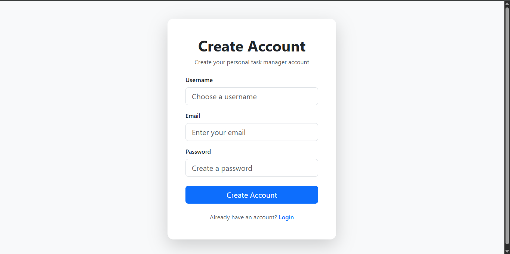
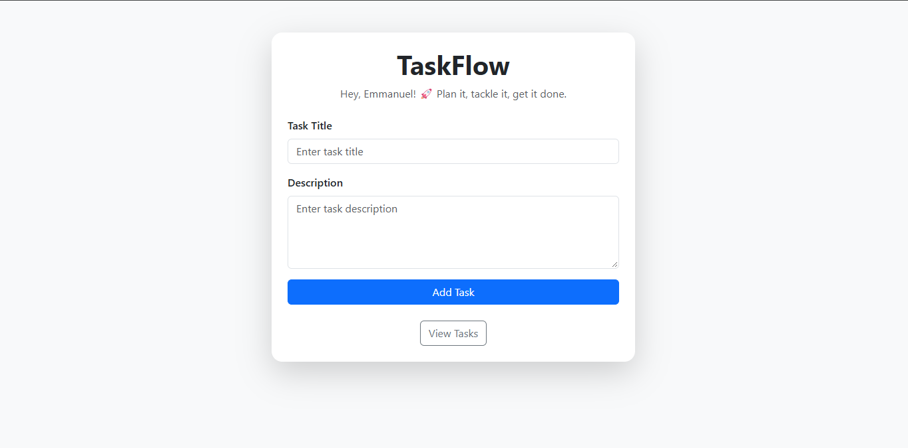
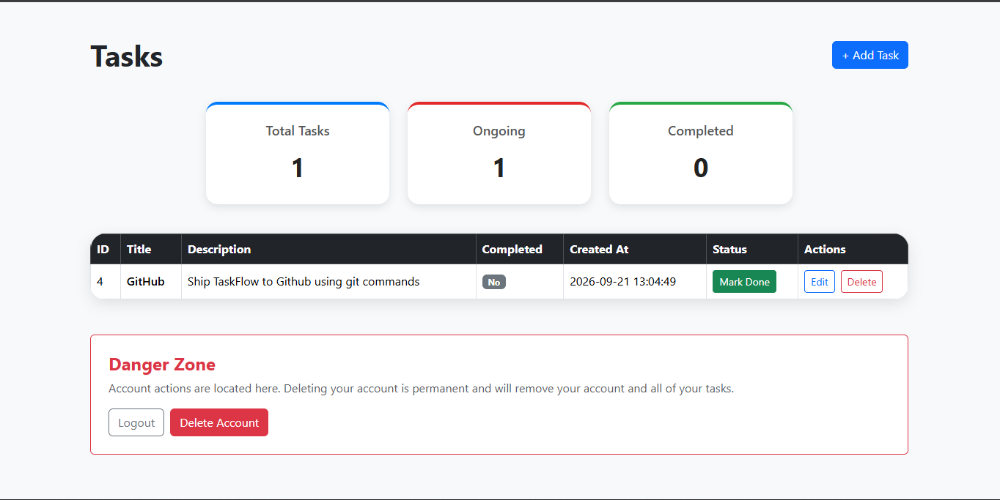

# TaskFlow

A full-stack task management application that allows users to create personal accounts, manage their tasks, and manage their accounts.

## Screenshots

### Registration 

### Add Task

### View Tasks

## Features

User registration and login

Create tasks with titles and descriptions

User-specific tasks

View and manage tasks

Flash messages for user feedback

Session-based authentication

SQLite database

Responsive Bootstrap interface

Account deletion

## Tech Stack

**Backend**: Flask

**Database**: SQLite

**Frontend**: HTML, CSS, Bootstrap

**Authentication**: Flask Sessions

**Environment Variables**: python-dotenv

## Getting Started

**Clone the Repository**
git clone <your-repository-url>
cd TaskFlow

**Install Dependencies**
pip install -r requirements.txt

**Configure Environment Variables**

Create a .env file in the project root:

SECRET_KEY=your-secret-key

**Run the Application**
python app.py

Then open your browser and visit:

http://127.0.0.1:5000

## Security

Sensitive configuration is stored in environment variables, and .env is excluded from version control using .gitignore.

## Development Note

The backend, business logic, and core functionality were designed and implemented by me. I used AI assistance for parts of the UI styling and frontend presentation. This note is included to accurately represent my contributions to the project.

## Project Status

This project was built as a practical Flask application to learn and demonstrate user authentication, session management, database relationships, and CRUD functionality.